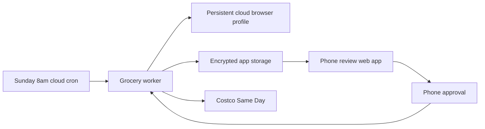

# Cloud Deployment Plan

This project is ready for a cloud-hosted review and approval workflow, while keeping Costco authentication outside chat and outside raw password storage.

## Target Architecture



## Authentication Boundary

Do not store `COSTCO_PASSWORD`.

Use a persistent cloud browser profile:

1. Start the cloud browser worker.
2. Open Costco Same Day in the hosted browser.
3. The user logs in manually, including MFA if required.
4. Persist the browser profile or Playwright storage state on encrypted disk.
5. Future scheduled runs reuse the session.
6. If Costco signs out, the worker reports `reauth required` and stops.

The code enforces this boundary with `CostcoCredentialPolicy`: if `COSTCO_PASSWORD` is present, cloud startup should fail.

## Required Secrets

- `GROCERY_AGENT_APPROVAL_SECRET`: HMAC secret for phone approval links.
- `GROCERY_AGENT_DATA`: path to persistent JSON storage or mounted volume path.
- `GROCERY_AGENT_CLOUD_STATE`: path to encrypted persistent browser session state.

Do not add Costco username/password secrets.

## Phone Review App

Run locally:

```bash
GROCERY_AGENT_APPROVAL_SECRET="$(openssl rand -hex 32)" python3 -m grocery_agent.cli serve-review --host 0.0.0.0 --port 8765
```

Open:

```text
http://localhost:8765/cart
```

The review app supports:

- cart review on mobile
- signed approval tokens
- signed rejection tokens
- approval of the cart for checkout review
- no final order placement

Final purchase still requires explicit approval after checkout totals, payment, delivery window, and tip are visible.

## Cloud Runtime Recommendation

Use a small VM or container host with persistent encrypted storage, not serverless-only infrastructure. Costco Same Day needs a real browser profile and may need manual reauth.

Good v1 options:

- Fly.io machine with volume
- Render background worker plus persistent disk
- Railway service plus mounted volume
- Small VPS with systemd timer

Use a private network or HTTPS in front of the review app. For public exposure, put the review app behind auth or use single-use signed links sent through a trusted channel.

## Sunday Schedule

Run at Sunday 8am in the household timezone:

```bash
python3 -m grocery_agent.cli proactive --today "$(date +%F)"
python3 -m grocery_agent.cli serve-review --host 0.0.0.0 --port 8765
```

For live Costco Same Day cart building, run the browser-backed command after preflight succeeds:

```bash
python3 -m grocery_agent.cli browser-preflight --strict
python3 -m grocery_agent.cli browser-build-cart "strawberries,raspberries,watermelon,oranges,onions,tomatoes,spinach,carrots,cherries,paneer,olive oil,scotch brite pads,broccoli" --settle-seconds 5
```

## Next Production Step

Add a Playwright cloud browser adapter that uses `GROCERY_AGENT_CLOUD_STATE` for a persistent profile. Keep the existing Chrome adapter for local Mac runs.
