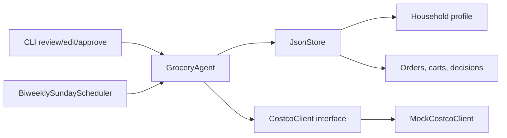

# Costco Grocery Ordering Agent

A modular personal grocery-ordering agent with a mocked Costco integration, JSON storage, cart review and approval gates, preference learning, and an every-other-Sunday proactive cart scheduler.

The current implementation is intentionally purchase-safe: it can generate and approve carts, but the mocked Costco adapter refuses to place any order unless explicit approval has been recorded.

## Architecture



Core modules:

- `grocery_agent.models`: typed data model for preferences, pantry estimates, order history, carts, approvals, and decision logs.
- `grocery_agent.costco`: integration interface plus mocked Costco inventory/order behavior.
- `grocery_agent.browser`: browser session abstraction, with fake test adapter and Chrome AppleScript adapter.
- `grocery_agent.costco_sameday`: Costco Same Day preflight, exact product-rule cart building, checkout review parsing, tip policy, and final approval gating.
- `grocery_agent.agent`: cart generation, substitution handling, preference learning, review, approval, and purchase guardrails.
- `grocery_agent.storage`: JSON-backed persistence.
- `grocery_agent.scheduler`: every-other-Sunday proactive cart creation helper.
- `grocery_agent.cli`: simple command line review, edit, approve, reject, and proactive-cart commands.

## Quickstart

```bash
python3 -m grocery_agent.cli init-demo
python3 -m grocery_agent.cli cart "milk, eggs, bananas, diapers"
python3 -m grocery_agent.cli review
python3 -m grocery_agent.cli approve
python3 -m grocery_agent.cli place-order
python3 -m grocery_agent.cli proactive --today 2026-05-24
```

By default data is stored in `.grocery_agent/data.json`. Override with:

```bash
GROCERY_AGENT_DATA=/path/to/data.json python3 -m grocery_agent.cli review
```

## Autonomous Costco Same Day Setup

The live browser workflow is designed to be autonomous after a safe preflight, but it still requires explicit approval before the final purchase unless policy is changed later.

Seed the household profile:

```bash
python3 -m grocery_agent.cli init-demo
```

Remember exact Costco Same Day product mappings:

```bash
python3 -m grocery_agent.cli remember-rule "onions" "red onions" "Red Onions, 5 lbs"
python3 -m grocery_agent.cli remember-rule "olive oil" "olive oil" "Kirkland Signature, Organic Extra Virgin Olive Oil, 2 L"
```

Set checkout defaults:

```bash
python3 -m grocery_agent.cli set-policy --address "1439 Tarrytown Street" --zip 94402 --tip 0 --max-total 250
```

Before live browser work, check the active Chrome tab:

```bash
python3 -m grocery_agent.cli browser-preflight --strict
```

The preflight checks:

- active tab is `sameday.costco.com`
- Same Day is signed in, not showing `Sign In / Register`
- delivery address matches policy when configured
- cart count is readable
- no purchase action occurs

## Safety Guardrails

- Orders cannot be placed without `APPROVED` cart status.
- Approval records include timestamp, approver, and an explicit approval statement.
- Expensive or unusual items are flagged before approval.
- Out-of-stock items are surfaced with substitutions and decision reasons.
- Every cart item stores a human-readable explanation for why it was added.
- The integration is abstracted behind `CostcoClient`, so Costco can later be replaced by Instacart, Whole Foods, Target, or browser automation.
- Live browser checkout requires a final approval statement before `Place order` is clicked.
- Retail browser automation verifies active tab, Same Day auth state, delivery address, cart count, and visible checkout totals before purchase.

## Tests

```bash
python3 -m unittest discover -s tests
```
