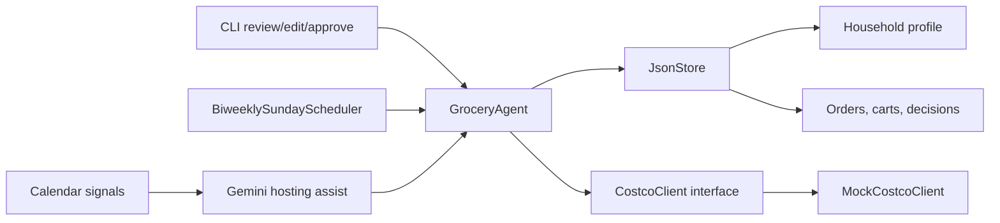

# Costco Grocery Ordering Agent

A modular personal grocery-ordering agent with a mocked Costco integration, JSON storage, cart review and approval gates, preference learning, an every-other-Sunday proactive cart scheduler, and a native Gemini-style hosting assistant that turns calendar signals into meal plans and grocery carts.

The current implementation is intentionally purchase-safe: it can generate and approve carts, but the mocked Costco adapter refuses to place any order unless explicit approval has been recorded.

## Architecture



Core modules:

- `grocery_agent.models`: typed data model for preferences, pantry estimates, order history, carts, approvals, and decision logs.
- `grocery_agent.costco`: integration interface plus mocked Costco inventory/order behavior.
- `grocery_agent.browser`: browser session abstraction, with fake test adapter and Chrome AppleScript adapter.
- `grocery_agent.costco_sameday`: Costco Same Day preflight, exact product-rule cart building, checkout review parsing, tip policy, and final approval gating.
- `grocery_agent.gemini_hosting`: native Gemini proactive hosting experience that detects at-home dinner events, suggests a menu, and creates a review-ready grocery cart.
- `grocery_agent.security`: signed phone approval tokens.
- `grocery_agent.cloud`: cloud credential/session policy helpers that reject raw Costco password storage.
- `grocery_agent.web_app`: phone-friendly cart review and approval app.
- `grocery_agent.agent`: cart generation, substitution handling, preference learning, review, approval, and purchase guardrails.
- `grocery_agent.storage`: JSON-backed persistence.
- `grocery_agent.scheduler`: every-other-Sunday proactive cart creation helper.
- `grocery_agent.cli`: simple command line review, edit, approve, reject, and proactive-cart commands.

## Quickstart

```bash
python3 -m grocery_agent.cli init-demo
python3 -m grocery_agent.cli cart "milk, eggs, bananas, diapers"
python3 -m grocery_agent.cli review
python3 -m grocery_agent.cli approve
python3 -m grocery_agent.cli place-order
python3 -m grocery_agent.cli proactive --today 2026-05-24
python3 -m grocery_agent.cli gemini-hosting examples/gemini_calendar_events.json --today 2026-05-13
```

By default data is stored in `.grocery_agent/data.json`. Override with:

```bash
GROCERY_AGENT_DATA=/path/to/data.json python3 -m grocery_agent.cli review
```

## Native Gemini Proactive Hosting

The `gemini-hosting` flow models a native Gemini experience: Gemini notices a likely at-home dinner from calendar context, infers guest count and dietary needs, proposes a complete menu, and prepares a Costco cart for review.

Example input:

```json
[
  {
    "title": "Hosting Indian dinner for 6",
    "start": "2026-05-16T18:30:00-07:00",
    "description": "Vegetarian friends coming over. Need an easy dinner plan and groceries.",
    "attendees": ["a@example.com", "b@example.com"]
  }
]
```

Run it:

```bash
python3 -m grocery_agent.cli gemini-hosting examples/gemini_calendar_events.json --today 2026-05-13
```

The output includes:

- event detection rationale
- estimated guest count and dietary notes
- meal plan across entree, sides, dessert, and drinks
- review-ready cart with substitution handling, budget checks, and decision logs
- the same explicit approval requirement before any order can be placed

## Autonomous Costco Same Day Setup

The live browser workflow is designed to be autonomous after a safe preflight, but it still requires explicit approval before the final purchase unless policy is changed later.

Seed the household profile:

```bash
python3 -m grocery_agent.cli init-demo
```

Remember exact Costco Same Day product mappings:

```bash
python3 -m grocery_agent.cli remember-rule "onions" "red onions" "Red Onions, 5 lbs"
python3 -m grocery_agent.cli remember-rule "olive oil" "olive oil" "Kirkland Signature, Organic Extra Virgin Olive Oil, 2 L"
```

Set checkout defaults:

```bash
python3 -m grocery_agent.cli set-policy --address "1439 Tarrytown Street" --zip 94402 --tip 0 --max-total 250
```

Before live browser work, check the active Chrome tab:

```bash
python3 -m grocery_agent.cli browser-preflight --strict
```

The preflight checks:

- active tab is `sameday.costco.com`
- Same Day is signed in, not showing `Sign In / Register`
- delivery address matches policy when configured
- cart count is readable
- no purchase action occurs

## Safety Guardrails

- Orders cannot be placed without `APPROVED` cart status.
- Approval records include timestamp, approver, and an explicit approval statement.
- Expensive or unusual items are flagged before approval.
- Out-of-stock items are surfaced with substitutions and decision reasons.
- Every cart item stores a human-readable explanation for why it was added.
- The integration is abstracted behind `CostcoClient`, so Costco can later be replaced by Instacart, Whole Foods, Target, or browser automation.
- Live browser checkout requires a final approval statement before `Place order` is clicked.
- Retail browser automation verifies active tab, Same Day auth state, delivery address, cart count, and visible checkout totals before purchase.

## Phone Review App

Run a local mobile-friendly review app:

```bash
GROCERY_AGENT_APPROVAL_SECRET="$(openssl rand -hex 32)" python3 -m grocery_agent.cli serve-review --host 0.0.0.0 --port 8765
```

Then open `/cart` from your phone through a secure tunnel or deployed HTTPS service.

The review app can approve or reject a review-ready cart. It does not place an order; final purchase still requires explicit approval after live checkout review.

### Remote Phone Review Notifications

Use Telegram for remote review without exposing the local web app. Create a bot with BotFather, then set:

```bash
export TELEGRAM_BOT_TOKEN="123456:telegram-bot-token"
```

Run the polling bot:

```bash
python3 -m grocery_agent.cli telegram-bot
```

Message the bot `/start` from Telegram to see your chat ID, then `/cart` to review the latest cart with inline Approve/Reject buttons. To lock the bot to your chat after you know the chat ID:

```bash
export TELEGRAM_CHAT_ID="123456789"
python3 -m grocery_agent.cli telegram-bot
```

Send the latest cart directly to one configured chat:

```bash
python3 -m grocery_agent.cli telegram-review
```

Expose the review app through HTTPS, for example with a tunnel or cloud deployment, then set:

```bash
export GROCERY_AGENT_REVIEW_BASE_URL="https://your-review-app.example"
```

Print the phone review link for any cloud app or message workflow:

```bash
python3 -m grocery_agent.cli review-link
```

Send the latest cart to Telegram:

```bash
export TELEGRAM_BOT_TOKEN="123456:telegram-bot-token"
export TELEGRAM_CHAT_ID="123456789"
python3 -m grocery_agent.cli notify-review
```

The `notify-review` command sends a "Review cart" button that opens the phone review app. The Telegram-native `telegram-bot` and `telegram-review` commands approve or reject directly through Telegram callback buttons. Final purchase still requires explicit checkout approval.

### Live Costco Telegram Flow

For real Costco Same Day ordering, first open Chrome to `sameday.costco.com`, sign in manually, and make sure the delivery address is correct. The agent does not store your Costco password.

Start the live bot:

```bash
export TELEGRAM_BOT_TOKEN="123456:telegram-bot-token"
export TELEGRAM_CHAT_ID="123456789"
python3 -m grocery_agent.cli telegram-costco-bot
```

In Telegram:

```text
/grocery strawberries, onions, olive oil
```

The bot will:

- open Costco Same Day in Google Chrome using the saved browser session
- check the active Costco Same Day Chrome tab
- add only items with remembered exact product rules
- open checkout review
- send checkout total, address, payment summary, delivery window, and item count back to Telegram
- show `Refresh review` and `Approve and place order` buttons

The final approval button clicks Costco's real `Place order` button. Use it only after checking the Telegram checkout review details.

## Cloud Deployment

See `CLOUD_DEPLOYMENT.md`.

The cloud plan uses a persistent browser session/profile instead of storing a Costco password. If Costco signs out or asks for MFA, the worker stops and asks the user to reauthenticate manually.

## Tests

```bash
python3 -m unittest discover -s tests
```
